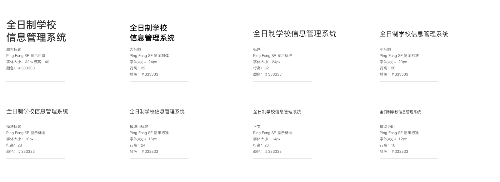

# 字体

### Sketch 使用 Ping Fang SC 为基础，尺寸 14px。

### 字体使用规范

| 中文字体   | 示例                                               | 大小 | 颜色    | 粗细 |
| :--------- | :------------------------------------------------- | :--- | :------ | :--- |
| 超大标题   | 我是超大标题   | 32   | #333333 | 加粗 |
| 大标题     | 我是大标题     | 24   | #333333 | 加粗 |
| 标题       | 我是标题       | 24   | #333333 | 标准 |
| 小标题     | 我是小标题     | 20   | #333333 | 标准 |
| 模块标题   | 我是模块标题   | 18   | #333333 | 标准 |
| 模块小标题 | 我是模块小标题 | 16   | #333333 | 标准 |
| 正文       | 我是正文       | 14   | #333333 | 标准 |
| 辅助说明   | 我是辅助说明   | 12   | #333333 | 标准 |

| 英文字体           | 示例                                                   | 大小 | 颜色    |
| :----------------- | :----------------------------------------------------- | :--- | :------ |
| giant title        | giant title        | 32   | #333333 | 加粗 |
| large title        | large title        | 24   | #333333 | 加粗 |
| title              | title              | 24   | #333333 | 标准 |
| small title        | small title        | 20   | #333333 | 标准 |
| module title       | module title       | 18   | #333333 | 标准 |
| small module title | small module title | 16   | #333333 | 标准 |
| text               | text               | 14   | #333333 | 标准 |
| help               | help               | 12   | #333333 | 标准 |

## 作者列表

| 作者   | 更新时间                    | 主要修改点 |
| :----- | :-------------------------- | :--------- |
| 黄李杰 | 2019 年 1 月 30 日 13:14:00 | 搭建组件   |
